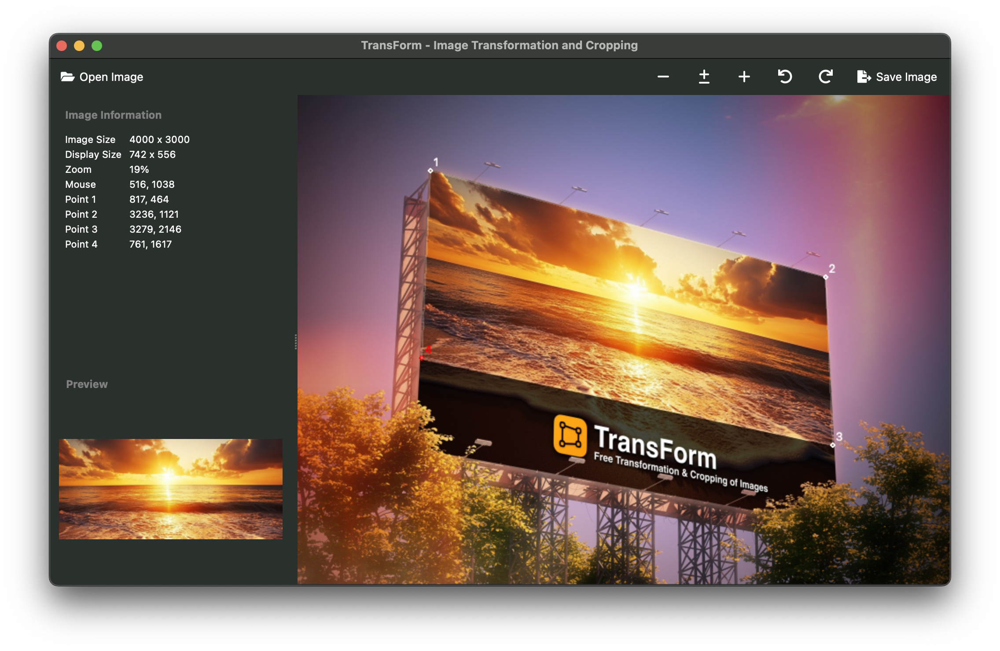

# TransForm - Image Transformation and Cropping


A simple macOS desktop application that allows you to apply free transformations and cropping to images by selecting four points.


## Table of Contents
- [Features](#features)
- [Screenshots](#screenshots)
- [Requirements](#requirements)
- [Installation](#installation)
- [Project Structure](#project-structure)
- [Usage](#usage)
- [Controls](#controls)
- [Tips](#tips)
- [Troubleshooting](#troubleshooting)
- [Contributing](#contributing)
- [License](#license)
- [Author](#author)
- [Acknowledgements](#acknowledgements)

## Features

- Load images (supports PNG, JPG, JPEG, BMP, and HEIC formats)
- Select four points in the image using mouse clicks
- Drag points to adjust their position
- Connect points with lines for better visualization
- Apply free transformations and crop the image
- Save the transformed image
- Zoom in/out and pan for detailed work
- Rotate images clockwise or counter-clockwise
- Automatic image scaling to fit the window

## Screenshots




## Requirements

- Python 3.6+
- OpenCV
- PySide6
- Pillow (for HEIC support)

## Installation

```bash
# Clone the repository
git clone https://github.com/rolandortner/transform.git
cd transform

# Install dependencies
pip install -r requirements.txt

# Run the application
python run.py

# Compile as macOS app
pyinstaller run.spec
```

## Project Structure

The project has been organized into a modular structure:

```
transform/
├── run.py                   # Application entry point
├── src/                     # Source code directory
│   ├── main.py              # Main application logic
│   ├── ui/                  # User interface components
│   │   ├── about_dialog.py  # About dialog implementation
│   │   └── main_window.py   # Main application window
│   └── utils/               # Utility functions
│       ├── icon_utils.py    # Icon loading utilities
│       └── image_utils.py   # Image processing functions
├── icons/                   # Application icons
└── requirements.txt         # Project dependencies
```

## Usage

1. Launch the application using `python run.py`
2. Click "Open Image" in the File menu or drag and drop an image into the application
3. Click on four points in the image to define the corners of the area to transform
4. Adjust the points by dragging them if needed considering the preview
5. Click "Save Image" in the File menu to save the transformed image

## Controls

- **Left Click**: Place or select points
- **Right Click + Drag**: Pan the image
- **Toolbar Buttons**:
  - Open Image: Load a new image
  - Zoom In/Out: Adjust zoom level
  - Reset Zoom: Fit image to window
  - Rotate: Rotate the image clockwise or counter-clockwise
  - Save Image: Apply free transformation and cropping and save the result
- **Keyboard Shortcuts**:
  - Ctrl+O: Open image
  - Ctrl+S: Save transformed image
  - Q: Quit application

## Tips

- Make sure to select the points in clockwise order for best results
- The points should form a quadrilateral in the original image
- You can drag points to fine-tune their position
- White circles indicate the four points, with the selected point highlighted in red
- White lines connect the points to help visualize the transformation area
- The transformed image will maintain the aspect ratio of the selected region 

## Troubleshooting

*Common issues and their solutions:*

- **HEIC images not loading**: Make sure you have Pillow and HEIC support libraries installed
- **Image appears distorted**: Ensure your four points form a proper quadrilateral in clockwise order

## Contributing

Contributions are welcome! Please feel free to submit a Pull Request.

1. Fork the repository
2. Create your feature branch (`git checkout -b feature/amazing-feature`)
3. Commit your changes (`git commit -m 'Add some amazing feature'`)
4. Push to the branch (`git push origin feature/amazing-feature`)
5. Open a Pull Request

## License

This project is open source and available under the [MIT License](LICENSE). This allows you to re-use the code freely, remixed in both commercial and non-commercial projects. The only requirement is to include the same license when distributing.

## Author

**Roland Ortner**

- GitHub: [@rolandortner](https://github.com/rolandortner)
- LinkedIn: [Roland Ortner](https://linkedin.com/in/rolandortner)

Feel free to reach out if you have questions or suggestions for improving TransForm!

## Acknowledgements

This application was developed with assistance from AI tools, specifically Codeium's Cascade and Windsurf. The AI helped with code implementation, debugging, and documentation, making the development process more efficient while I maintained creative direction and final decision-making.